# DTP – Authentication

Live design (claude.ai): https://claude.ai/artifact/3yrLoqbXXfeXzXq92dp9fT

Each screen: `*.dc.html` = design source (Graphite components + inline layout), `screenshots/*.png` = rendered reference at the board size. `canvas.json` = board layout/order on the canvas. `ds/` = the Graphite DS version this design was drawn with.

| Screen | Title | Size | Screenshot |
|---|---|---|---|
| `Main.dc.html` | Default | 1440×900 | 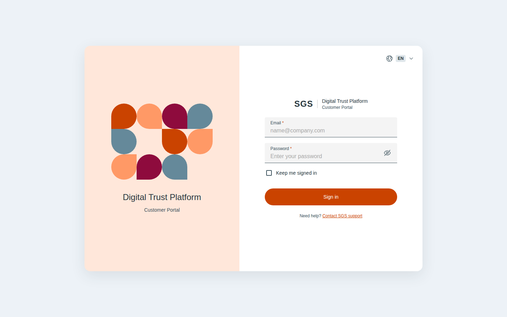 |
| `CustomerLoginWrongPassword.dc.html` | Wrong email or password | 1440×900 | 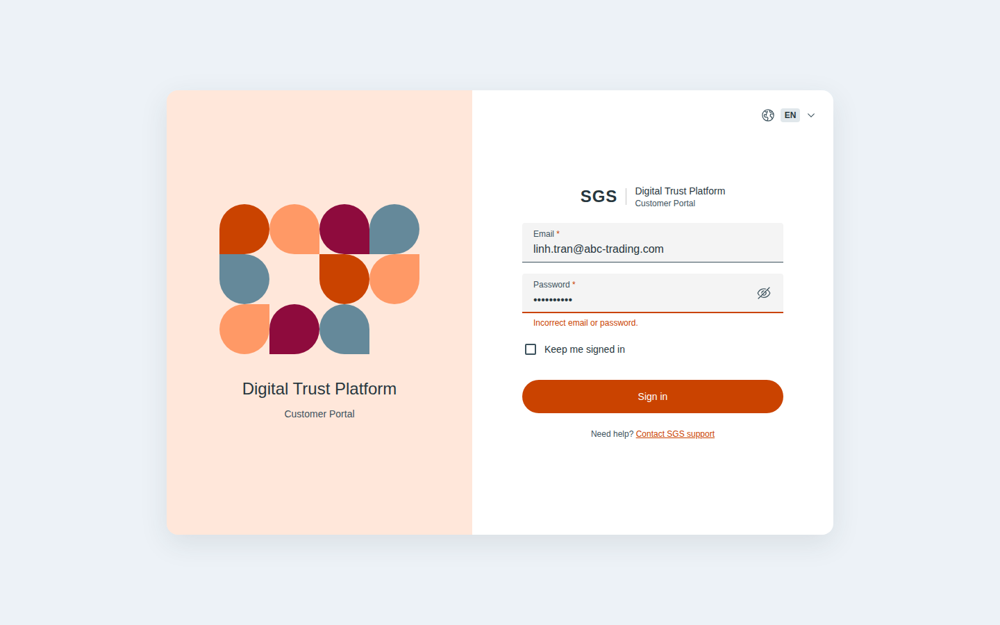 |
| `CustomerLoginLocked.dc.html` | Locked after failed attempts | 1440×900 | 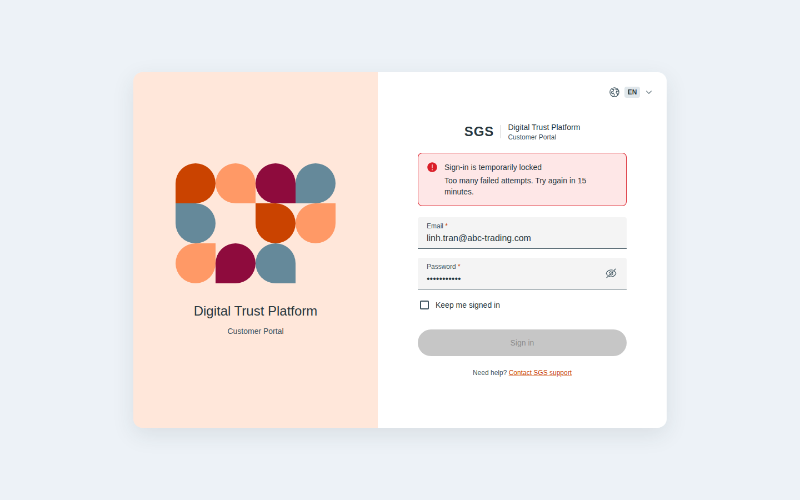 |
| `CustomerLoginInactive.dc.html` | Account deactivated | 1440×900 | 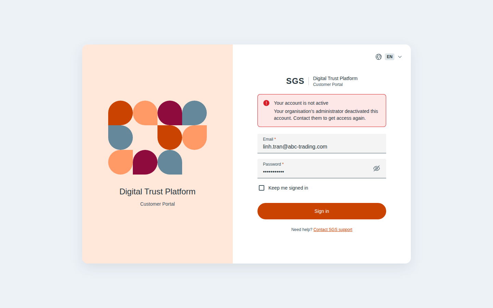 |
| `SgsLogin.dc.html` | Default | 1440×900 | 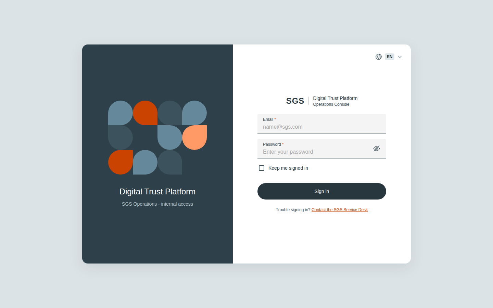 |
| `SgsLoginWrongPassword.dc.html` | Wrong email or password | 1440×900 | 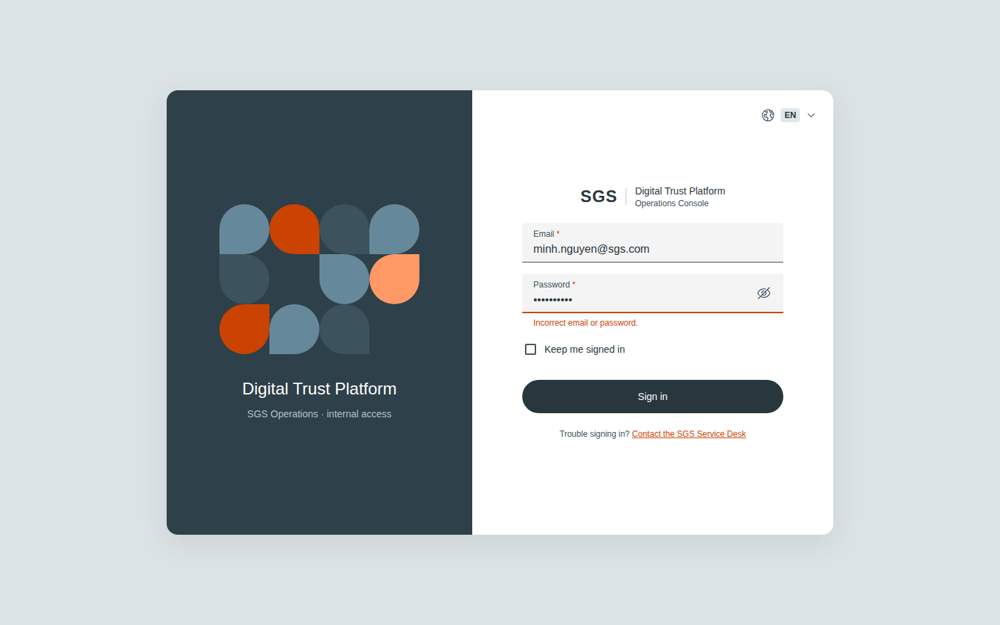 |
| `SgsLoginLocked.dc.html` | Locked after failed attempts | 1440×900 | 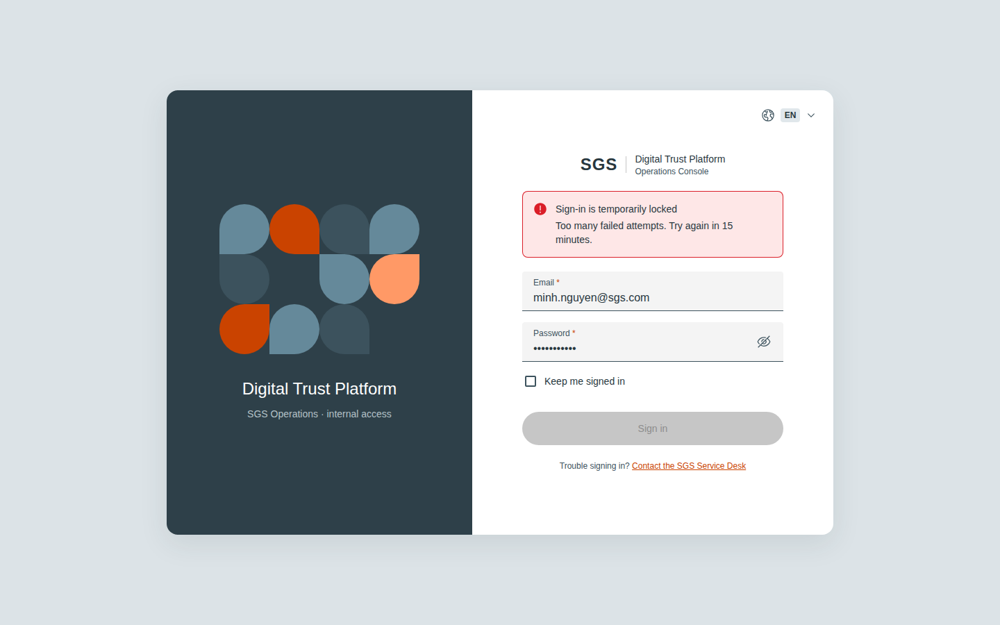 |
| `SgsLoginInactive.dc.html` | Account deactivated | 1440×900 | 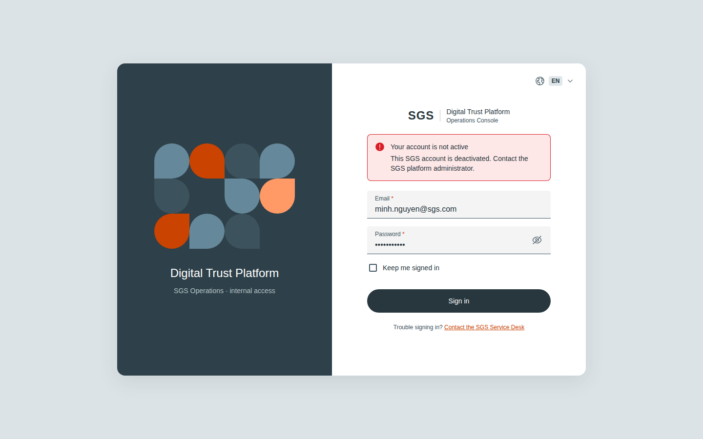 |
| `InviteEmail.dc.html` | Invitation email | 720×900 | 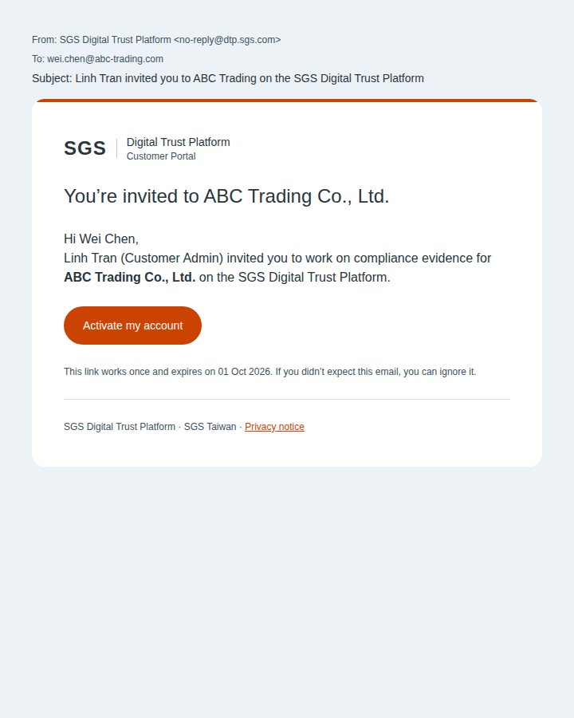 |
| `Activate.dc.html` | Activate · empty | 1440×900 |  |
| `ActivatePassword.dc.html` | Activate · password rules | 1440×900 | 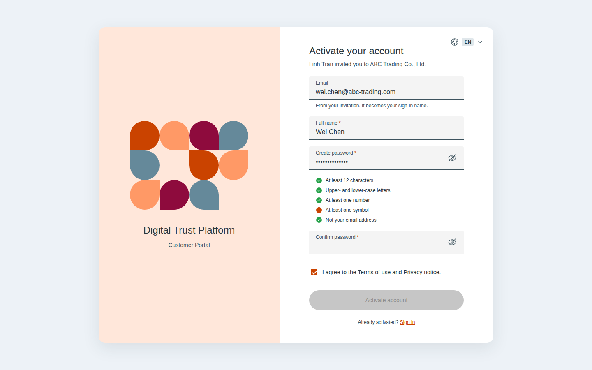 |
| `ActivateMismatch.dc.html` | Activate · passwords don’t match | 1440×900 | 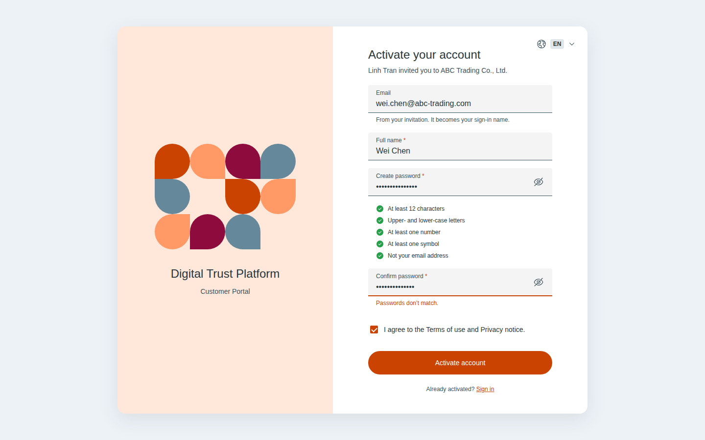 |
| `ActivateSuccess.dc.html` | Activated | 1440×900 | 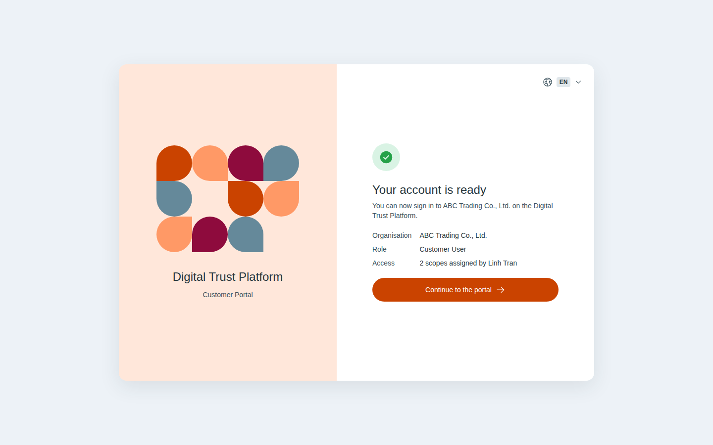 |
| `ActivateExpired.dc.html` | Link expired | 1440×900 |  |
| `ActivateUsed.dc.html` | Already activated | 1440×900 | 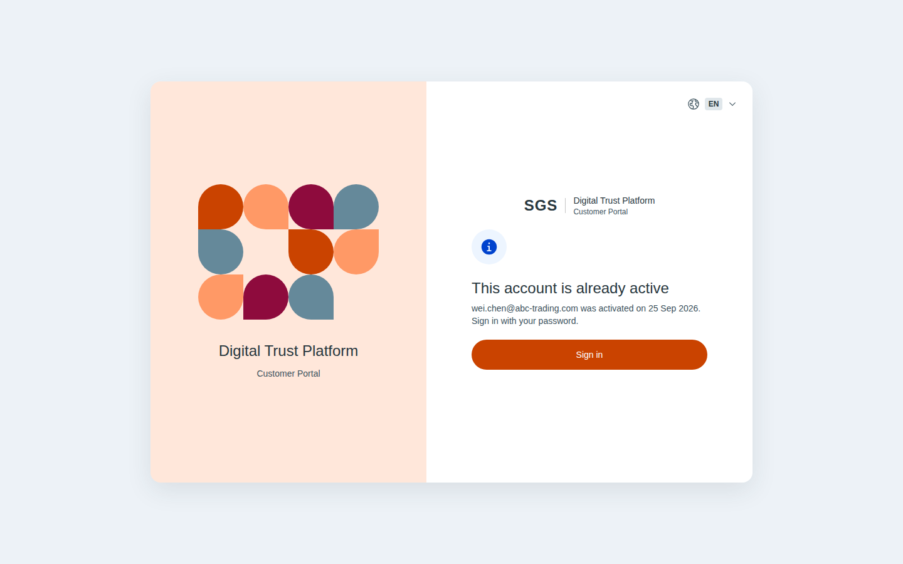 |
| `SgsActivate.dc.html` | SGS account · activate | 1440×900 | 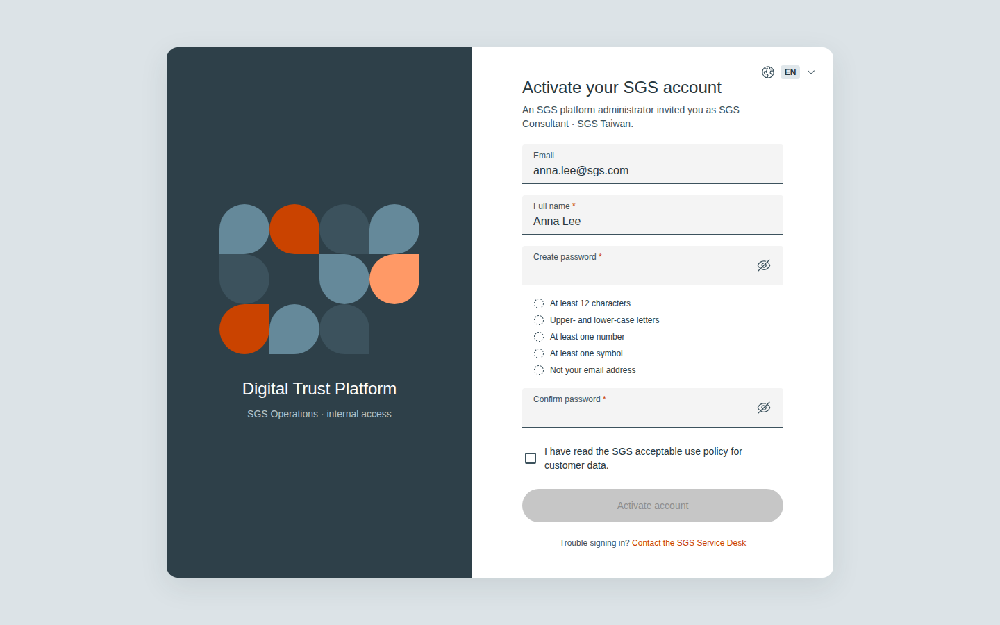 |

## Notes on the canvas

- UC-AUTH-001 · Log in · Customer Portal
- UC-AUTH-001 · Log in · SGS Operations
- Activate account from invitation
