# SGS Operations – Login Redesign

Live design (claude.ai): https://claude.ai/artifact/4LKKSGoJ3NPGCucvqS12kG

Each screen: `*.dc.html` = design source (Graphite components + inline layout), `screenshots/*.png` = rendered reference at the board size. `canvas.json` = board layout/order on the canvas. `ds/` = the Graphite DS version this design was drawn with.

| Screen | Title | Size | Screenshot |
|---|---|---|---|
| `Main.dc.html` | Sign in – Desktop 1440 (default) | 1440×900 | 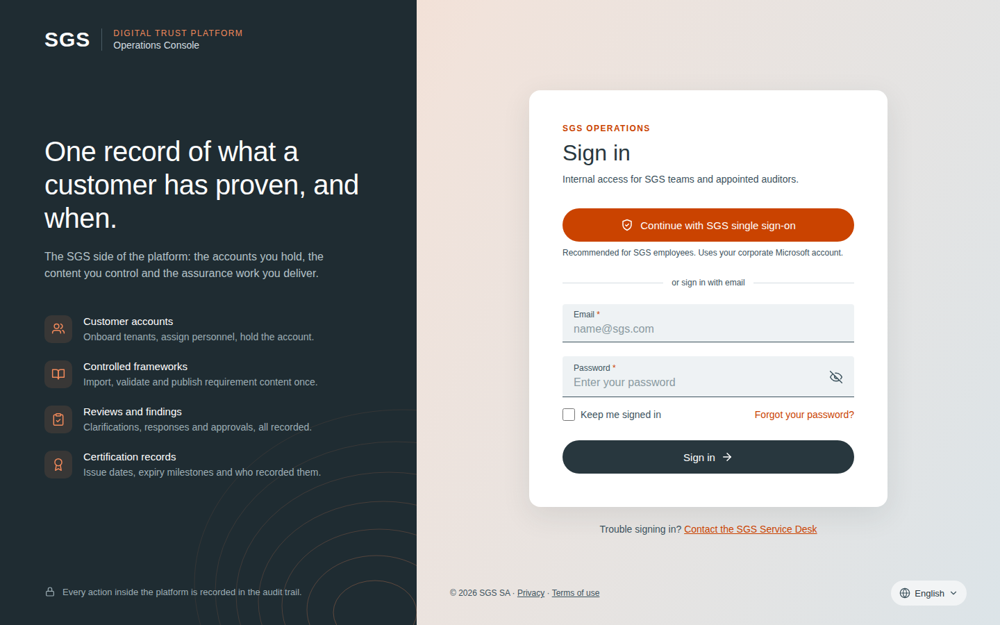 |
| `SignInError.dc.html` | Sign in – Error + snackbar | 1440×900 | 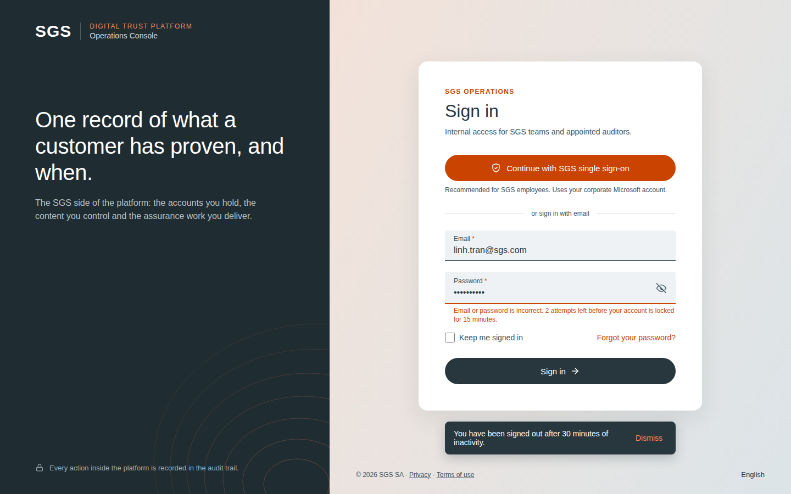 |
| `SignInMobile.dc.html` | Sign in – Mobile 412 | 412×900 | 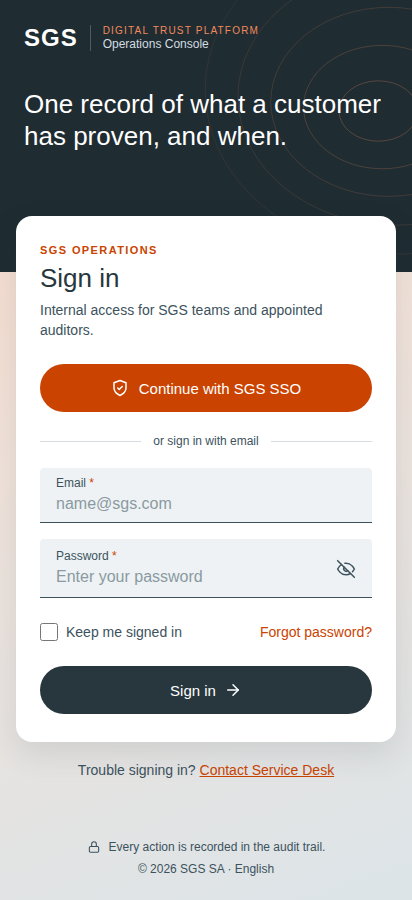 |
| `CustomerLogin.dc.html` | Customer Portal – Default | 1440×900 | 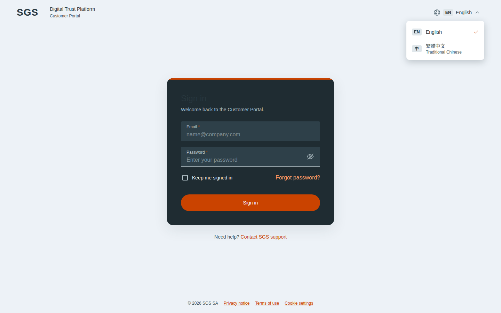 |
| `SgsOpsLogin.dc.html` | SGS Operations – Default | 1440×900 | 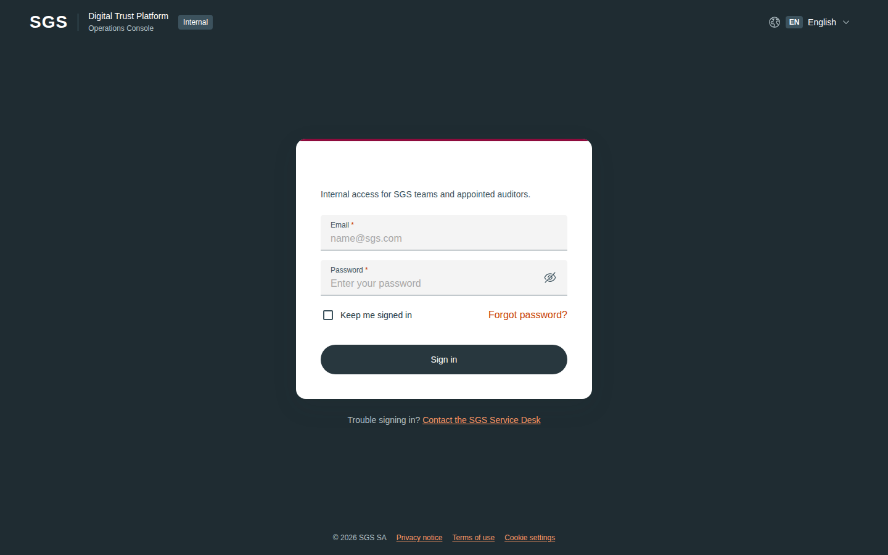 |
| `CustomerLoginWrongPassword.dc.html` | Customer Portal – Wrong password | 1440×900 | 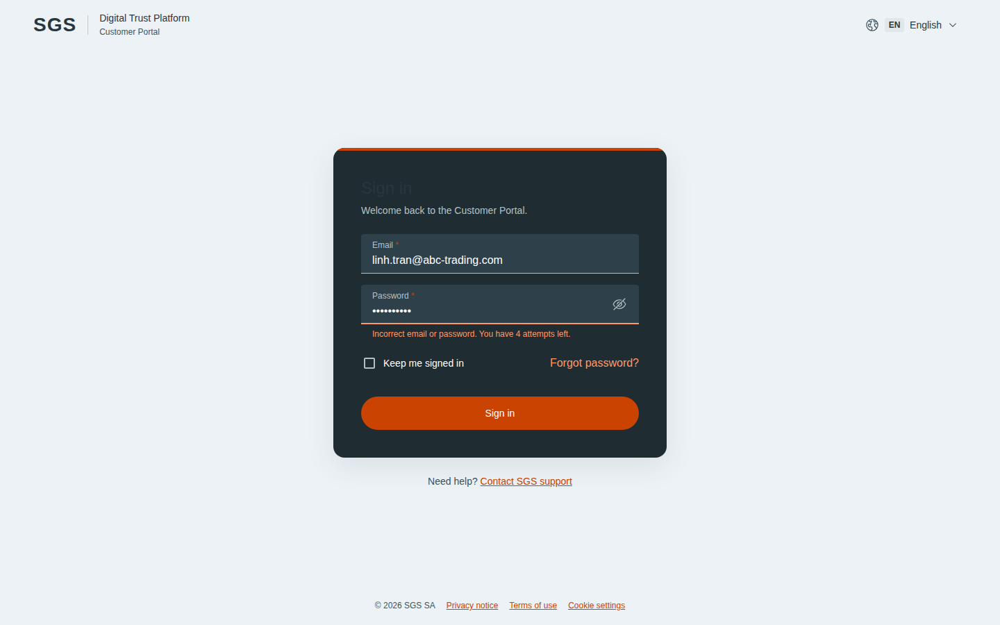 |
| `CustomerLoginError.dc.html` | Customer Portal – System error | 1440×900 | 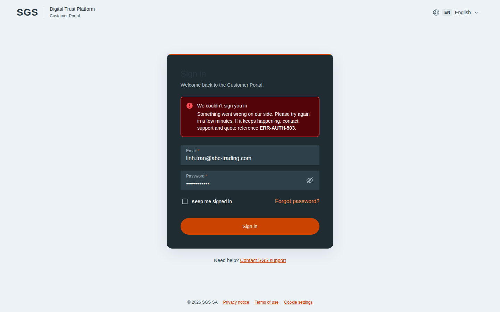 |
| `SgsOpsLoginWrongPassword.dc.html` | SGS Operations – Wrong password | 1440×900 | 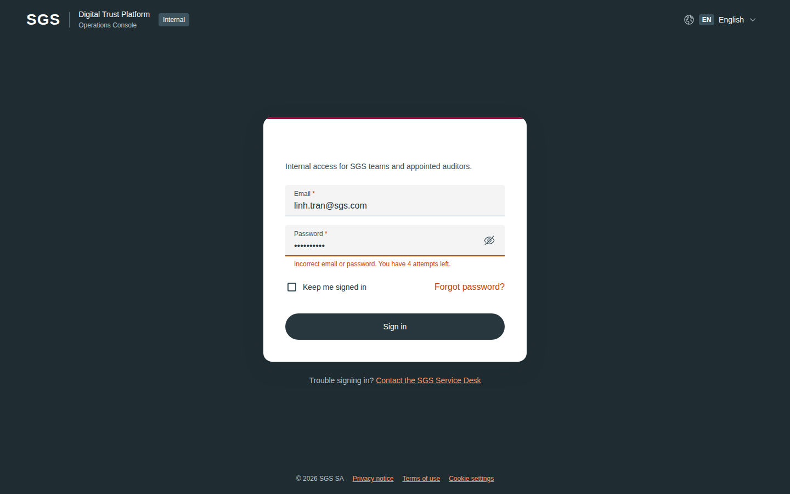 |
| `SgsOpsLoginError.dc.html` | SGS Operations – System error | 1440×900 | 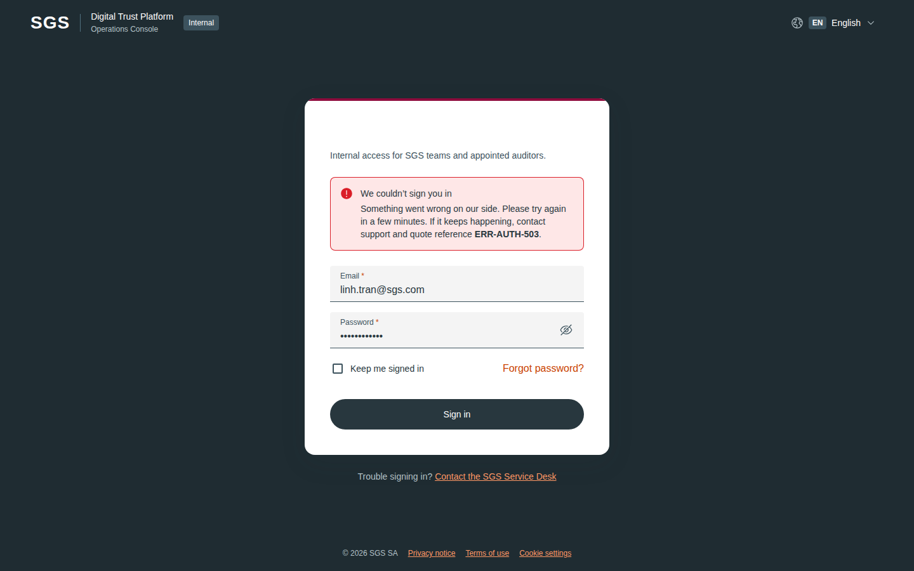 |
| `CustomerLoginSplit.dc.html` | Customer Portal – Split layout | 1440×900 | 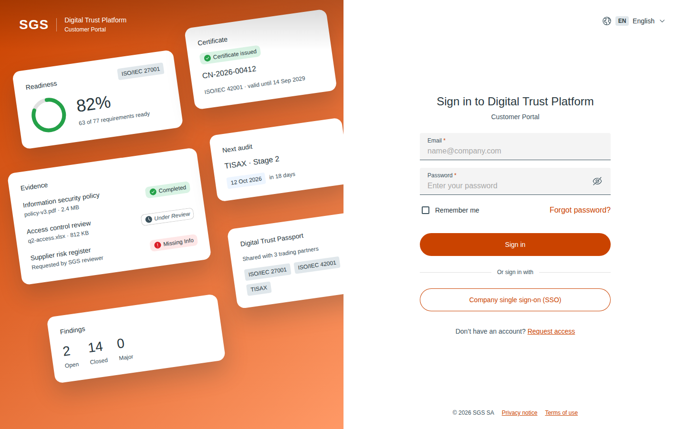 |
| `SgsOpsLoginSplit.dc.html` | SGS Operations – Split layout | 1440×900 | 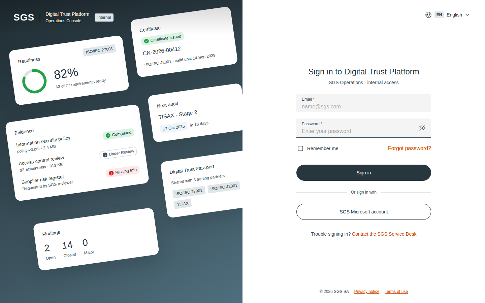 |

## Notes on the canvas

- SGS Operations – Sign in
- v3 – Simple sign-in, two themes (Graphite DS)
- v4 – Split layout with product preview
