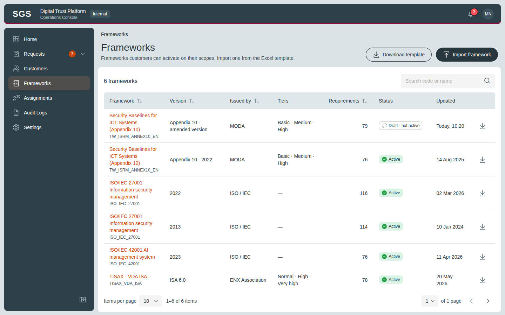
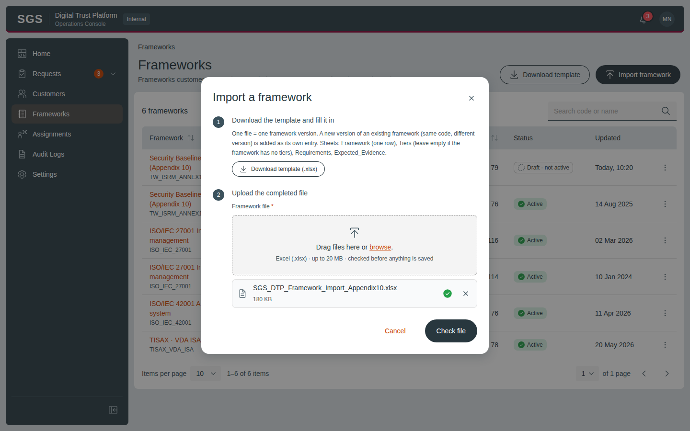
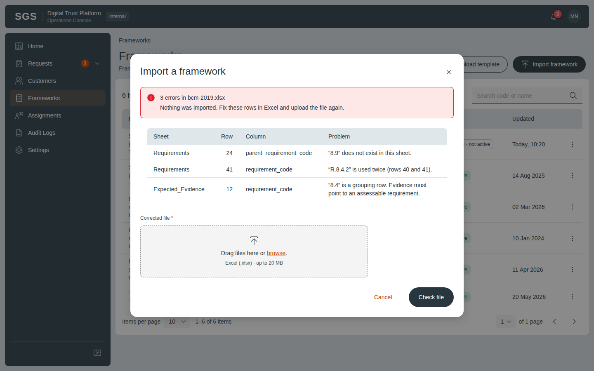
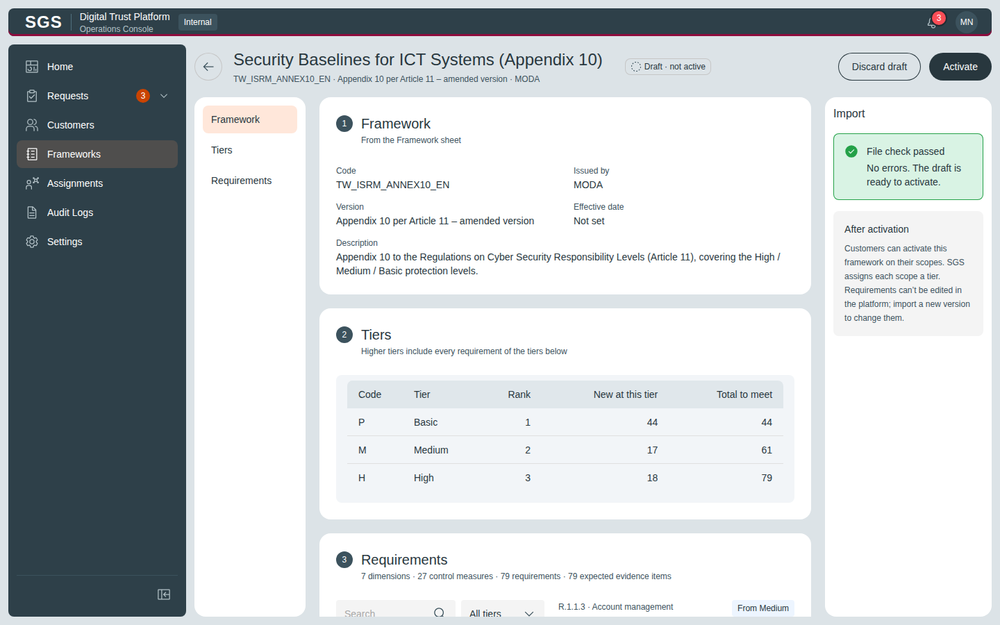
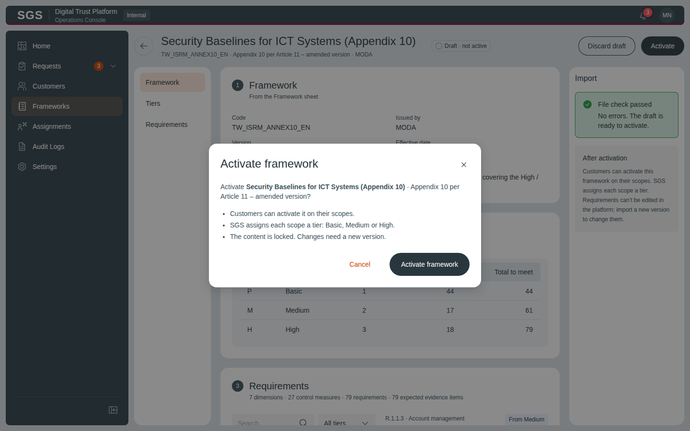
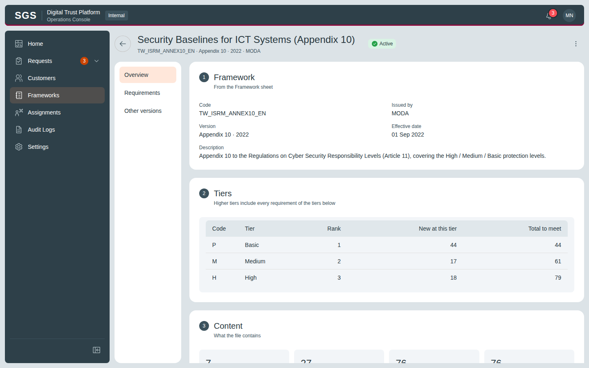
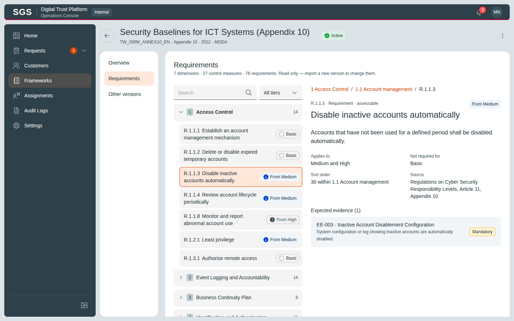

# DTP – Framework Management

Live design (claude.ai): https://claude.ai/artifact/NZKJMKQ6BfPQNYeVBuHbV4

Each screen: `*.dc.html` = design source (Graphite components + inline layout), `screenshots/*.png` = rendered reference at the board size. `canvas.json` = board layout/order on the canvas. `ds/` = the Graphite DS version this design was drawn with.

| Screen | Title | Size | Screenshot |
|---|---|---|---|
| `Main.dc.html` | Frameworks | 1440×900 |  |
| `FwImport.dc.html` | Import a framework | 1440×900 |  |
| `FwErrors.dc.html` | Import · errors in the file | 1440×900 |  |
| `FwPreview.dc.html` | Draft · review | 1440×900 |  |
| `FwActivate.dc.html` | Activate | 1440×900 |  |
| `FwDetail.dc.html` | Active version · Overview | 1440×900 |  |
| `FwRequirements.dc.html` | Active version · Requirements | 1440×900 |  |

## Notes on the canvas

- SGS Admin · Frameworks
