# DTP – Scope, Workspace & Evidence

Live design (claude.ai): https://claude.ai/artifact/25puixK1xDRkwwCvS8RMR4

Each screen: `*.dc.html` = design source (Graphite components + inline layout), `screenshots/*.png` = rendered reference at the board size. `canvas.json` = board layout/order on the canvas. `ds/` = the Graphite DS version this design was drawn with.

| Screen | Title | Size | Screenshot |
|---|---|---|---|
| `Main.dc.html` | Scopes | 1440×900 | 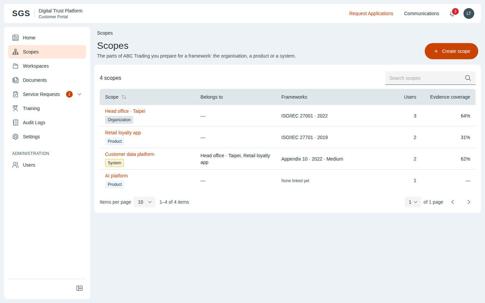 |
| `ScopesEmpty.dc.html` | Scopes · empty | 1440×900 | 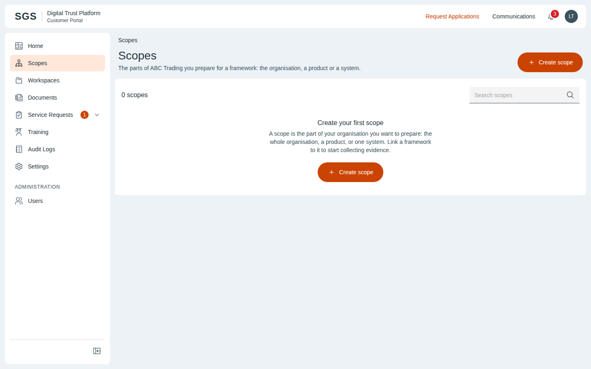 |
| `ScopeCreate.dc.html` | Create scope (System) | 1440×900 | 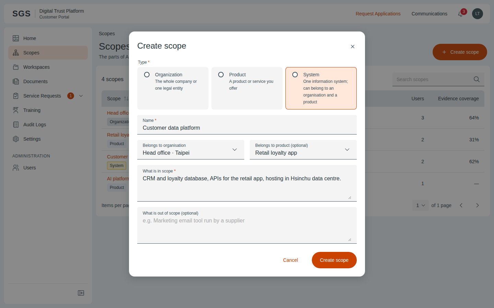 |
| `ScopeDetail.dc.html` | Scope detail | 1440×900 | 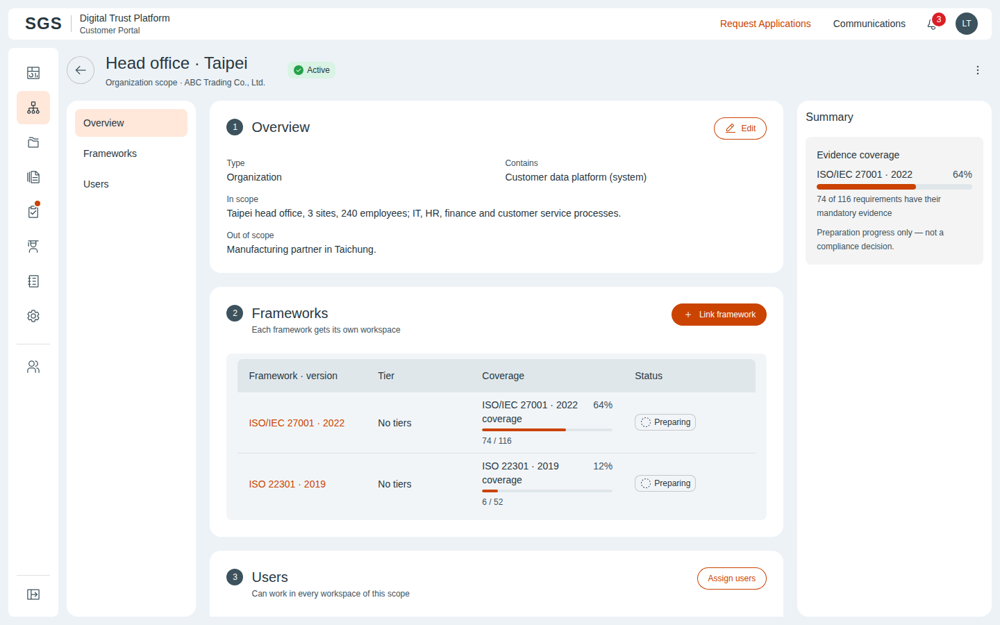 |
| `AssignUsers.dc.html` | Assign users | 1440×900 | 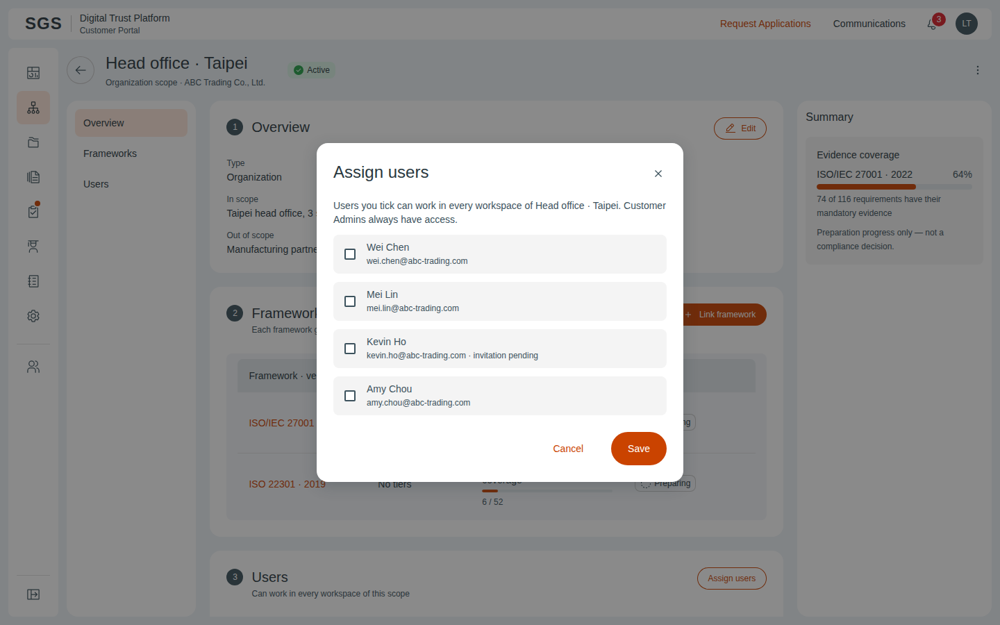 |
| `LinkFramework.dc.html` | Link framework + tier | 1440×900 | 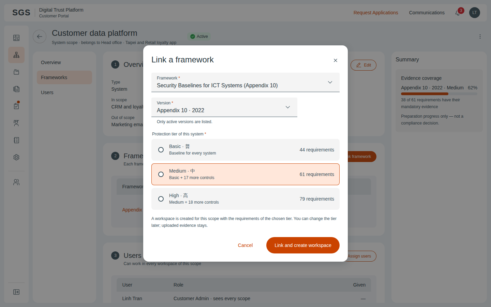 |
| `ChangeTier.dc.html` | Change tier | 1440×900 | 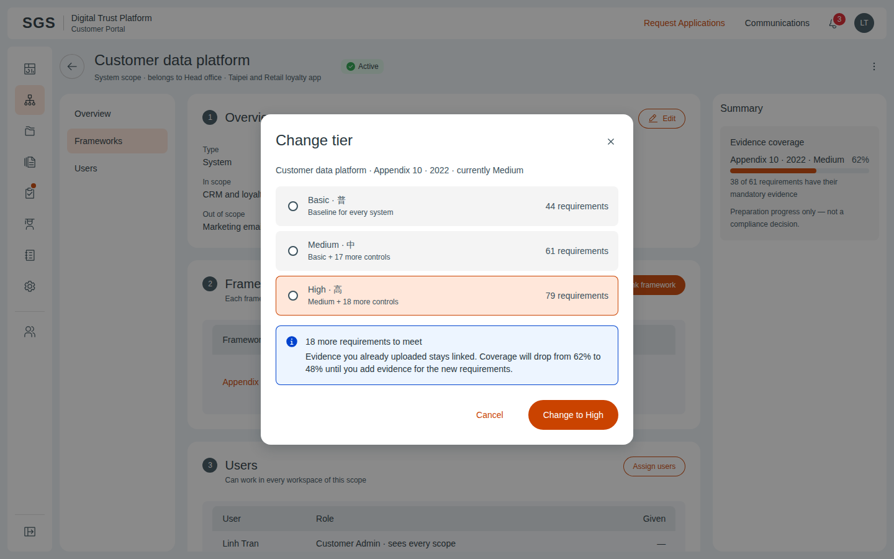 |
| `Workspaces.dc.html` | Workspaces | 1440×900 | 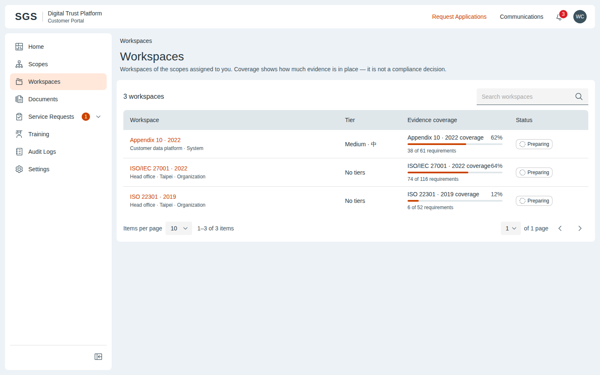 |
| `Workspace.dc.html` | Workspace | 1440×900 | 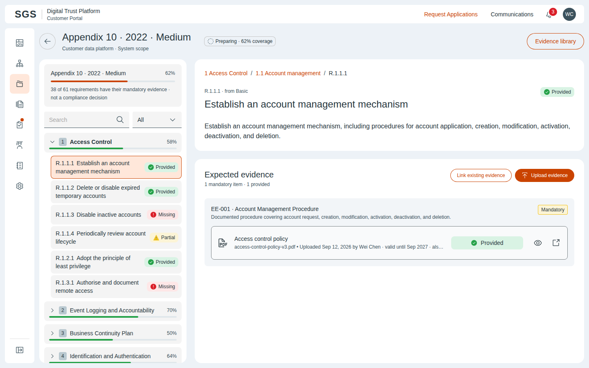 |
| `UploadEvidence.dc.html` | Upload evidence | 1440×900 | 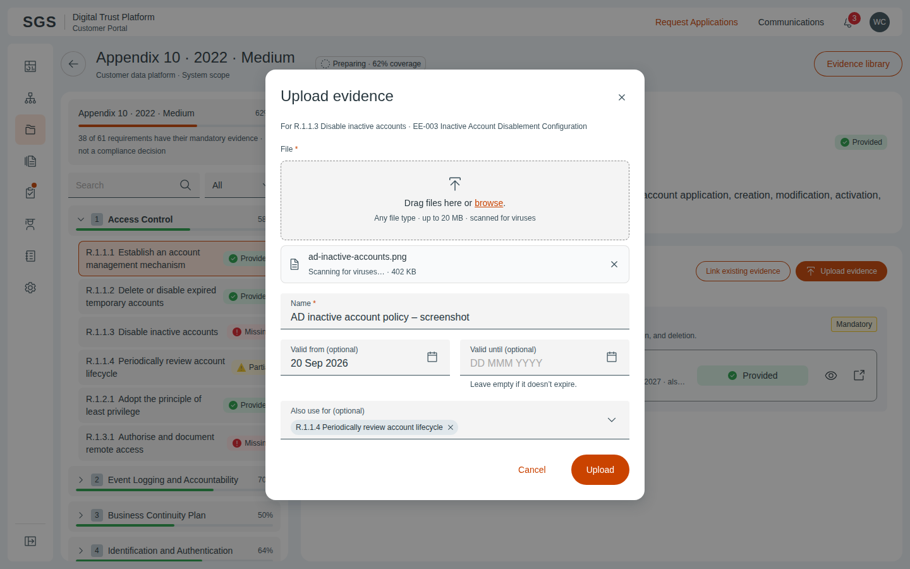 |
| `LinkEvidence.dc.html` | Link existing evidence | 1440×900 | 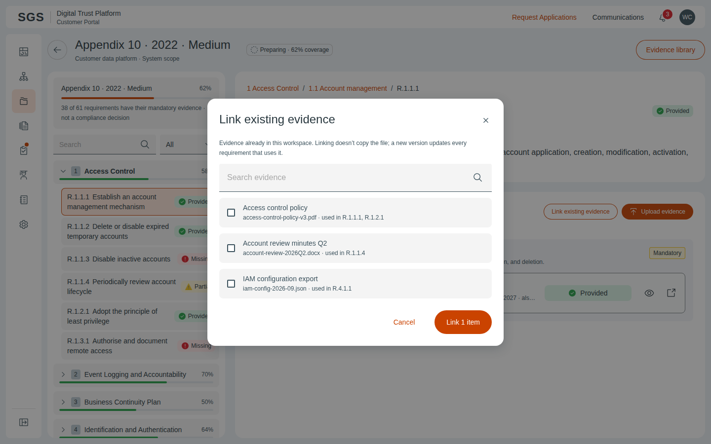 |
| `EvidenceDetail.dc.html` | Evidence detail | 1440×900 | 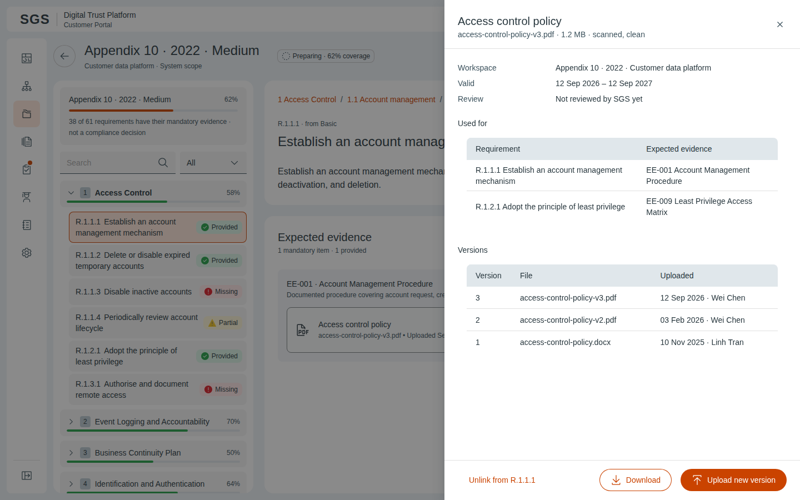 |
| `EvidenceLibrary.dc.html` | Documents · opened from the workspace | 1440×900 | 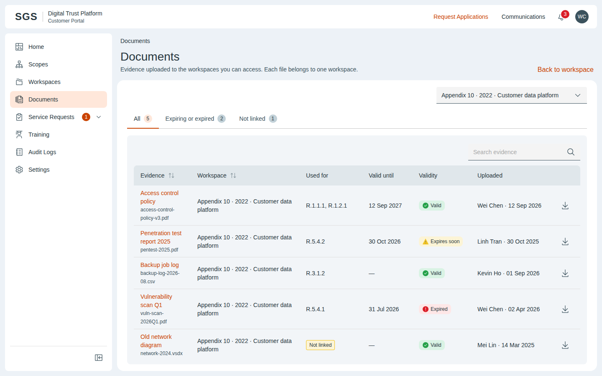 |
| `Documents.dc.html` | Documents · all workspaces | 1440×900 | 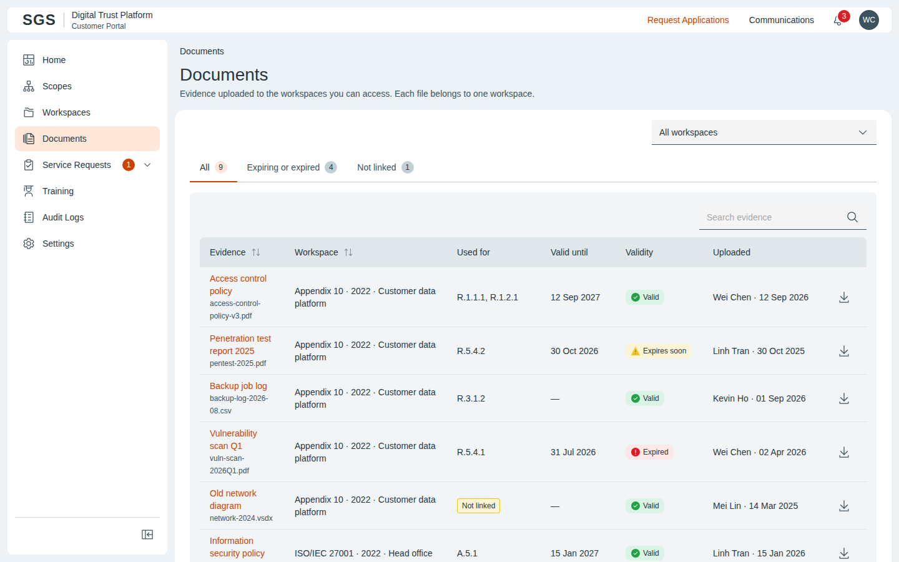 |
| `ChangeTierLocked.dc.html` | Change tier · locked during an audit | 1440×900 | 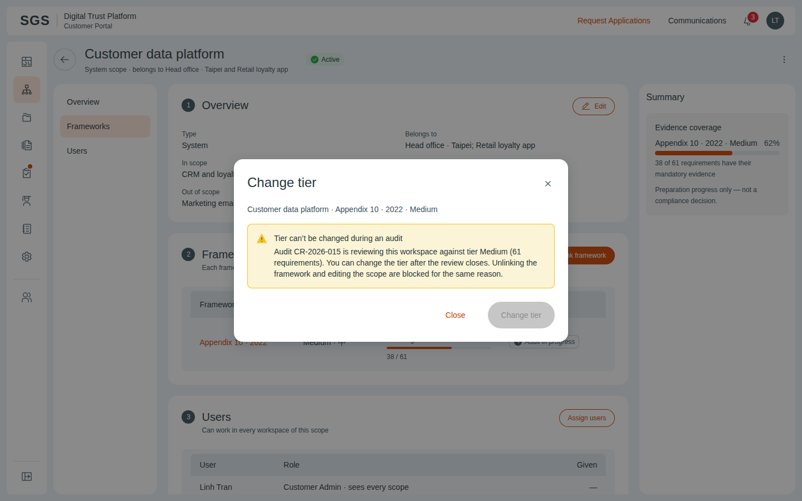 |

## Notes on the canvas

- Customer Admin · Scopes
- Customer User · Workspace & evidence
