# DTP – Certification & Training

Live design (claude.ai): https://claude.ai/artifact/YcRHreLL6KPDcEHiFBqHNy

Each screen: `*.dc.html` = design source (Graphite components + inline layout), `screenshots/*.png` = rendered reference at the board size. `canvas.json` = board layout/order on the canvas. `ds/` = the Graphite DS version this design was drawn with.

| Screen | Title | Size | Screenshot |
|---|---|---|---|
| `Main.dc.html` | Certification catalog | 1440×900 | 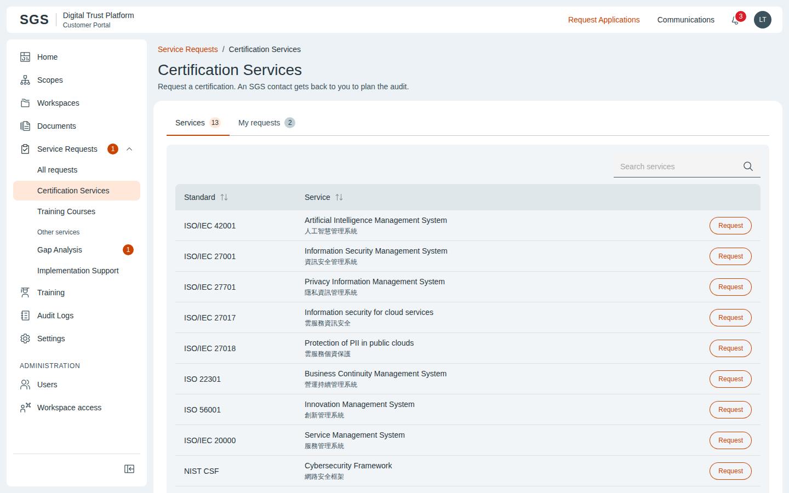 |
| `CertRequest.dc.html` | Request certification | 1440×900 | 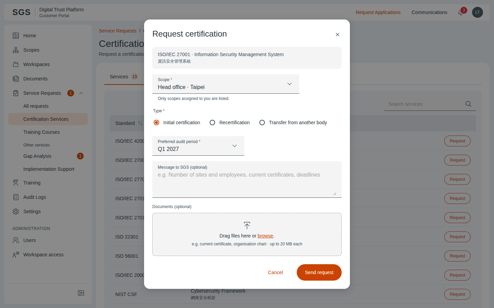 |
| `CertDetail.dc.html` | Request · Submitted | 1440×900 | 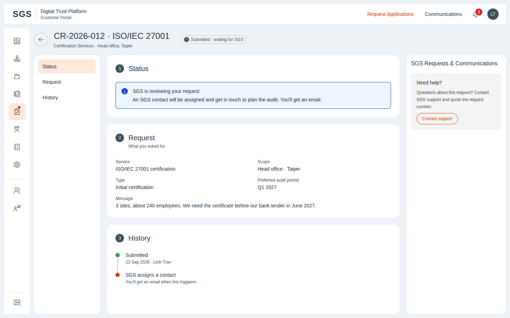 |
| `CertDetailAssigned.dc.html` | Request · Assigned | 1440×900 | 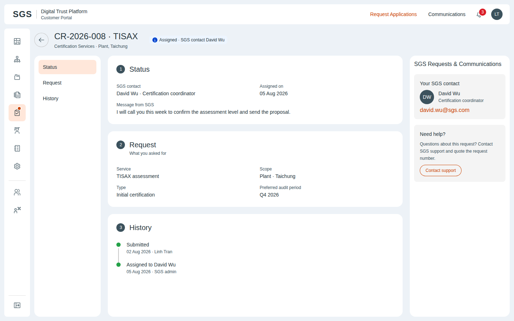 |
| `TrainList.dc.html` | Training catalog | 1440×900 | 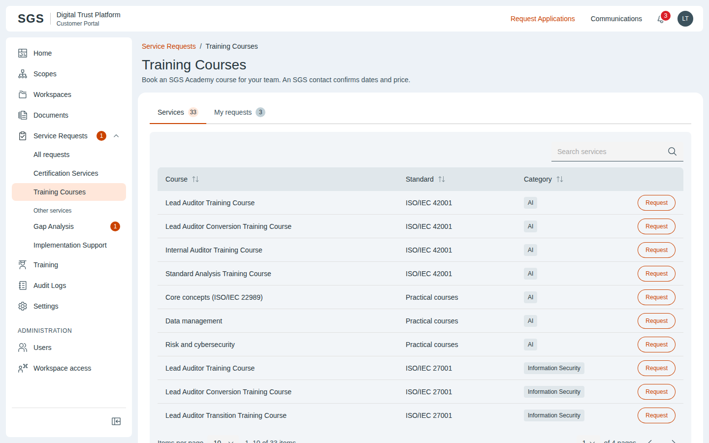 |
| `TrainRequest.dc.html` | Request a course | 1440×900 | 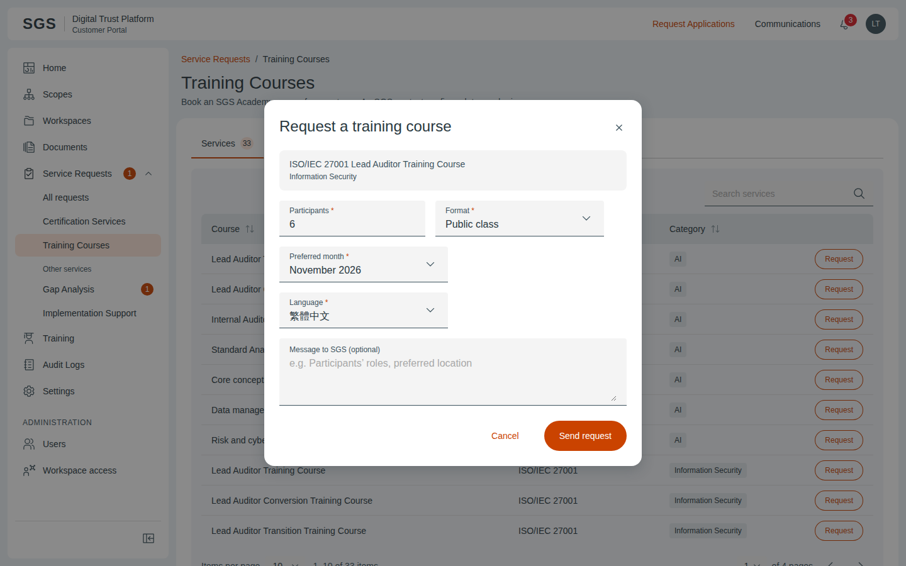 |
| `TrainDetail.dc.html` | Request · Submitted | 1440×900 | 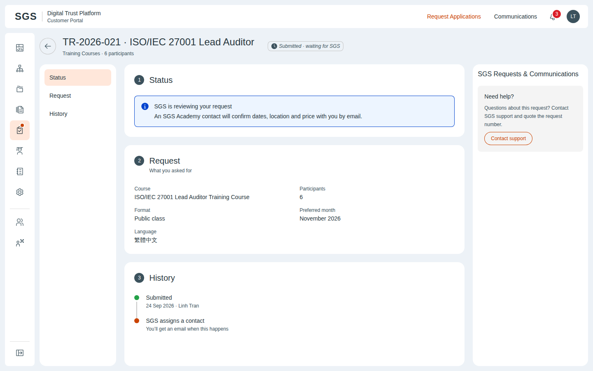 |
| `CertAdminQueue.dc.html` | Certification requests | 1440×900 | 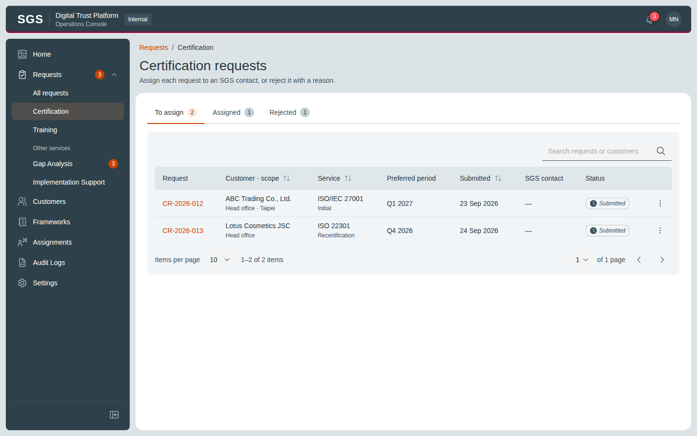 |
| `CertAdminAssign.dc.html` | Assign certification request | 1440×900 | 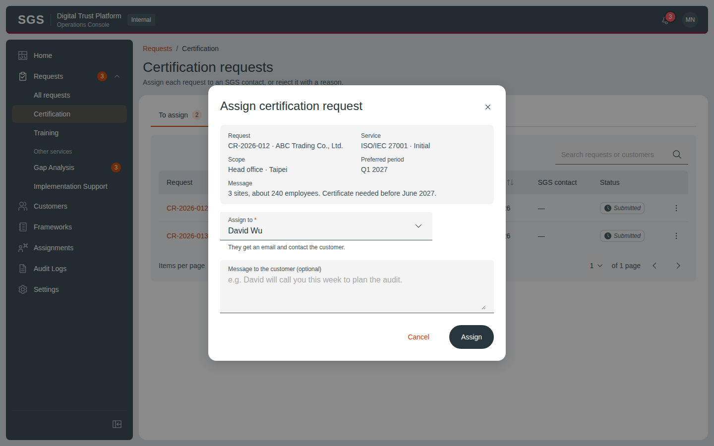 |
| `AdminReject.dc.html` | Reject request | 1440×900 | 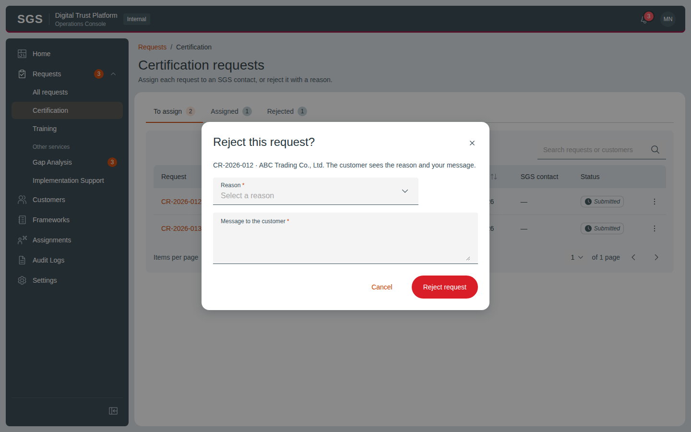 |
| `TrainAdminQueue.dc.html` | Training requests | 1440×900 |  |
| `TrainAdminAssign.dc.html` | Assign training request | 1440×900 | 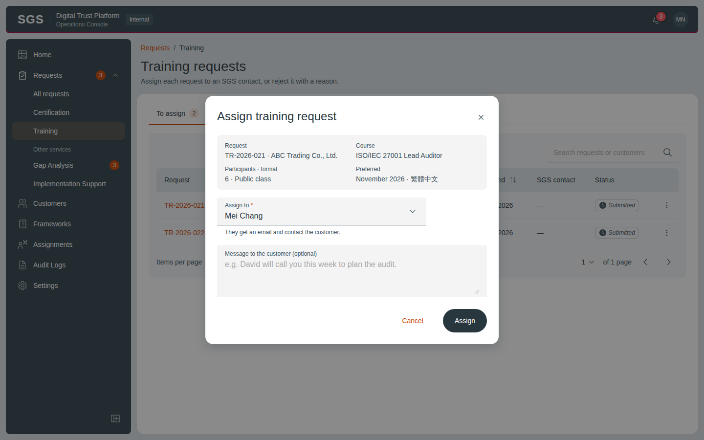 |

## Notes on the canvas

- Customer · Certification Services
- Customer · Training Courses
- SGS Admin
