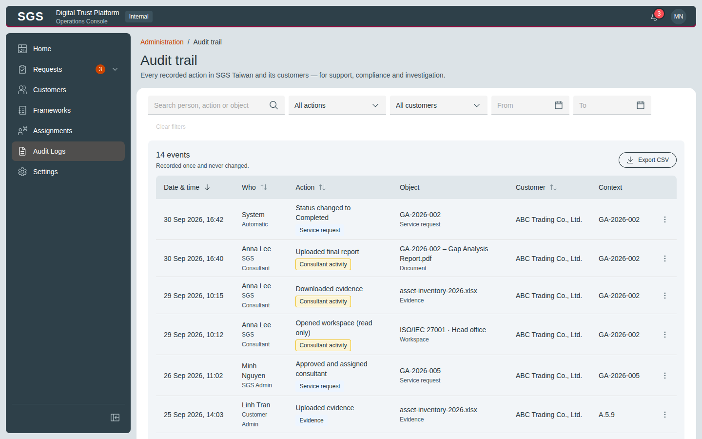
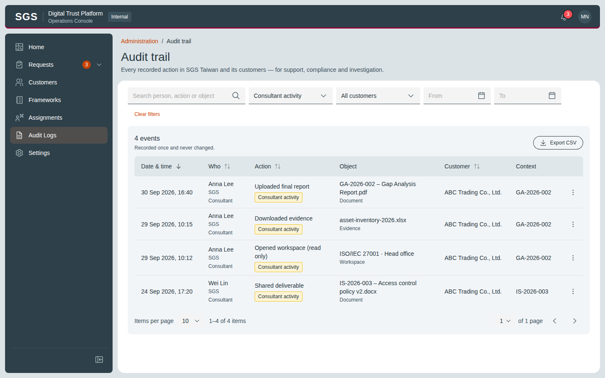
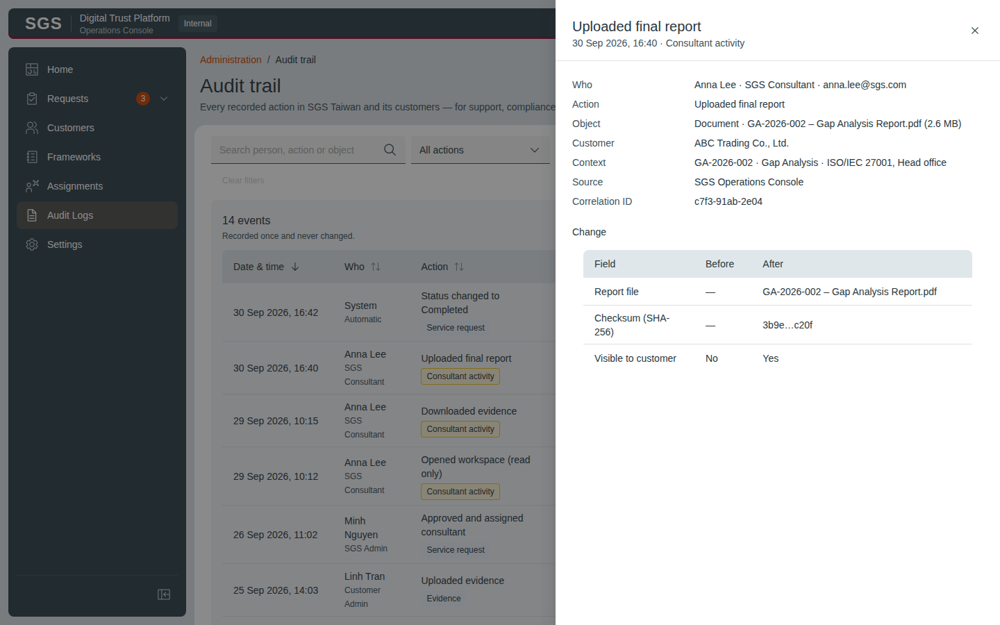
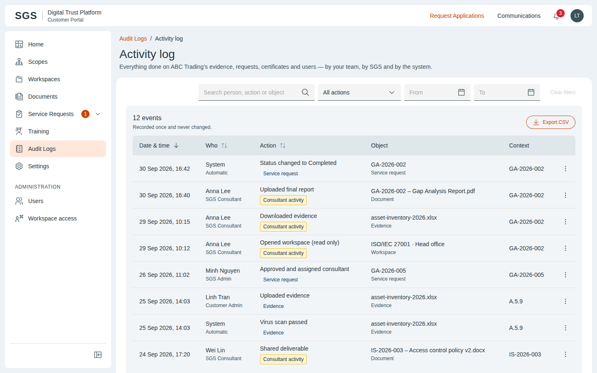
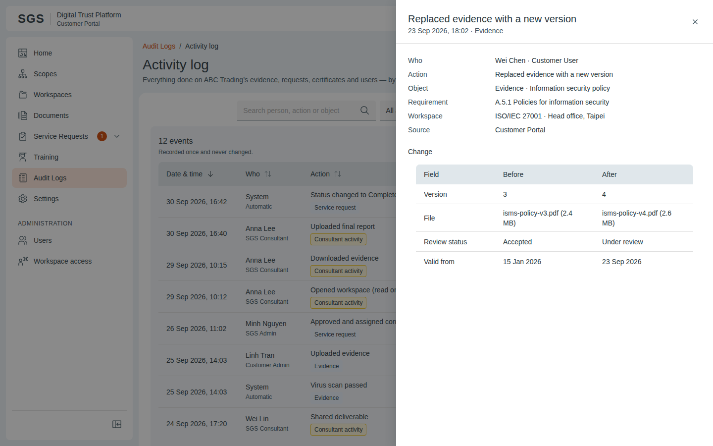

# DTP – Audit Trail

Live design (claude.ai): https://claude.ai/artifact/5Z8kNMFYN2ADAES8z5fDvh

Each screen: `*.dc.html` = design source (Graphite components + inline layout), `screenshots/*.png` = rendered reference at the board size. `canvas.json` = board layout/order on the canvas. `ds/` = the Graphite DS version this design was drawn with.

| Screen | Title | Size | Screenshot |
|---|---|---|---|
| `Main.dc.html` | Audit trail | 1440×900 |  |
| `SgsAuditConsultant.dc.html` | Filtered · consultant activity | 1440×900 |  |
| `SgsAuditDetail.dc.html` | Event detail | 1440×900 |  |
| `CaActivity.dc.html` | Activity log | 1440×900 |  |
| `CaActivityDetail.dc.html` | Event detail | 1440×900 |  |

## Notes on the canvas

- UC-AUD-002 · SGS Admin · Audit trail
- UC-AUD-004 · Customer Admin · Activity log
