# Unified Comment Thread — Role Design

Live design (claude.ai): https://claude.ai/artifact/FfhtdScVpjFRzXn8YYidSA

Each screen: `*.dc.html` = design source (Graphite components + inline layout), `screenshots/*.png` = rendered reference at the board size. `canvas.json` = board layout/order on the canvas. `ds/` = the Graphite DS version this design was drawn with.

| Screen | Title | Size | Screenshot |
|---|---|---|---|
| `Main.dc.html` | SGS Portal — one thread | 1280×1240 | 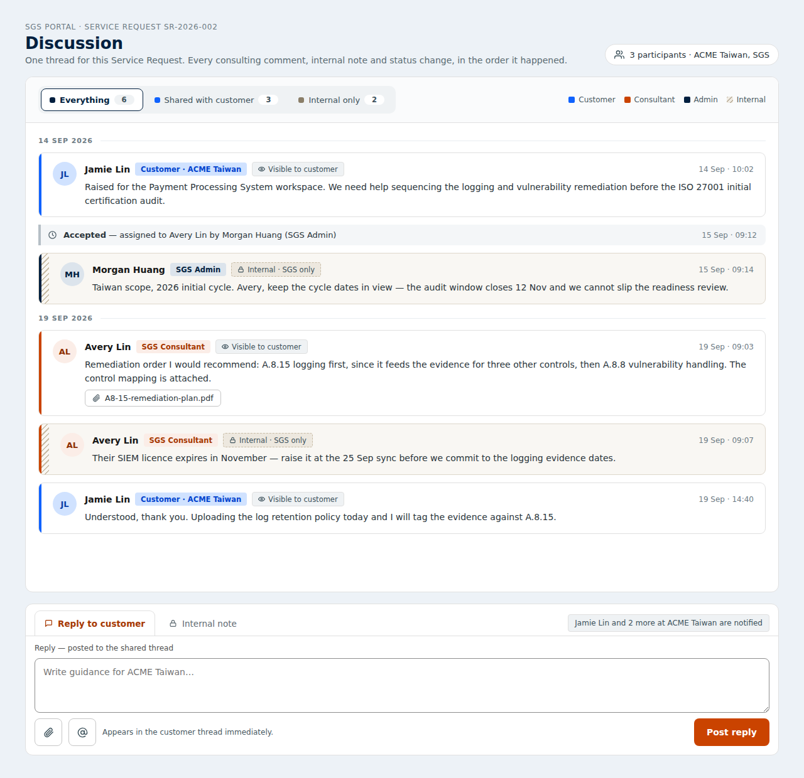 |
| `Customer.dc.html` | Customer Portal — same thread, filtered | 1280×1240 | 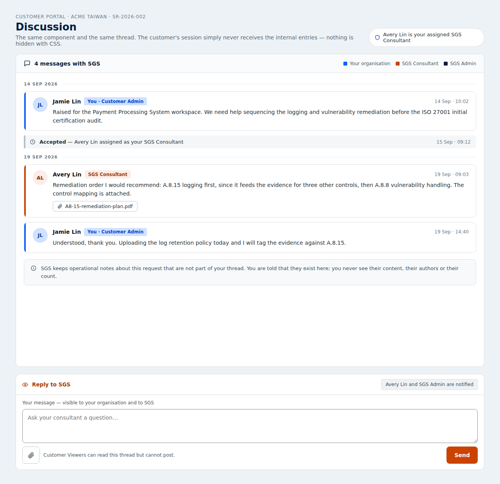 |
| `Roles.dc.html` | Anatomy and role palette | 1280×940 | 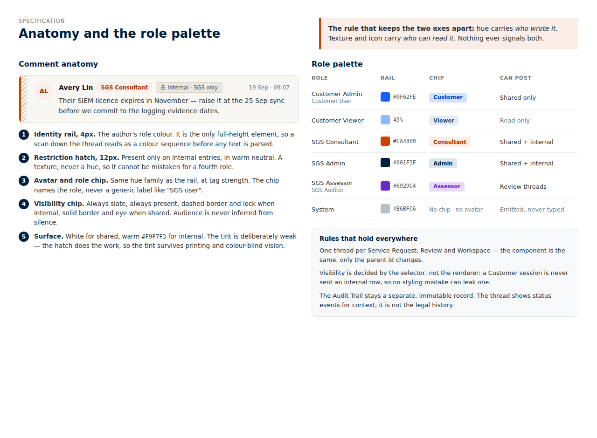 |
| `States.dc.html` | Composer and thread states | 1280×940 | 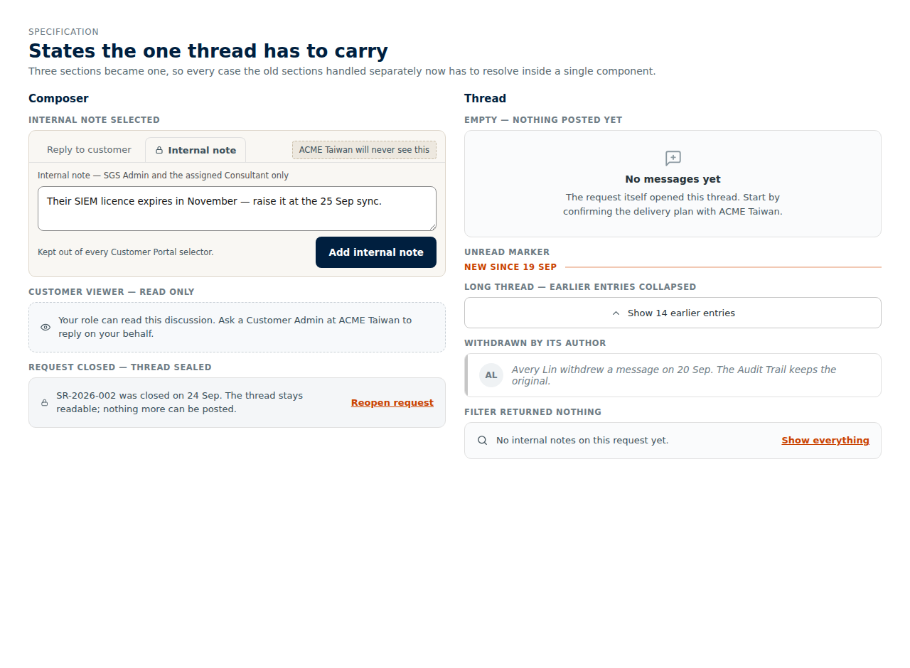 |
| `Migration.dc.html` | Four places to one thread | 1280×820 | 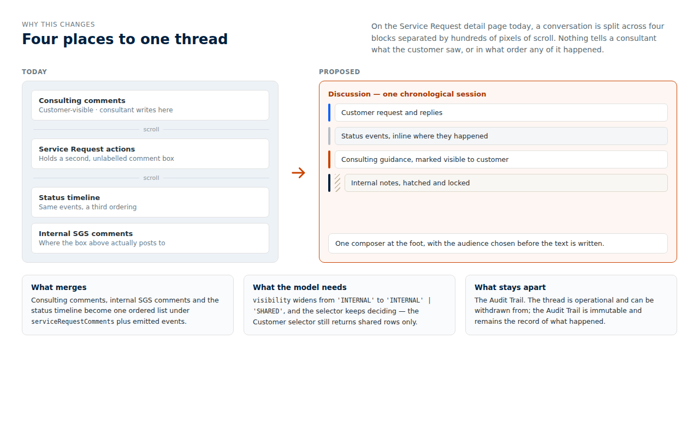 |
| `FullPage.dc.html` | Service Request detail — the whole page | 1440×2020 | 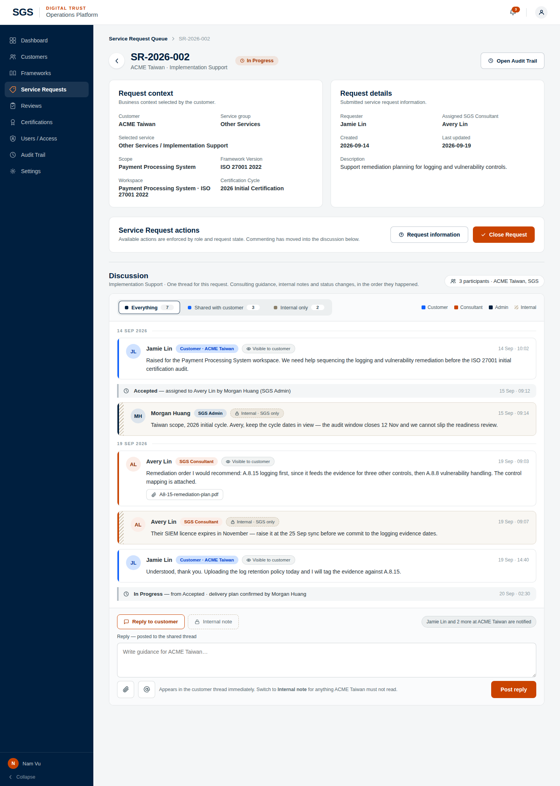 |
| `Submitted.dc.html` | Submitted — Accept or Reject, no triage step | 1440×1880 | 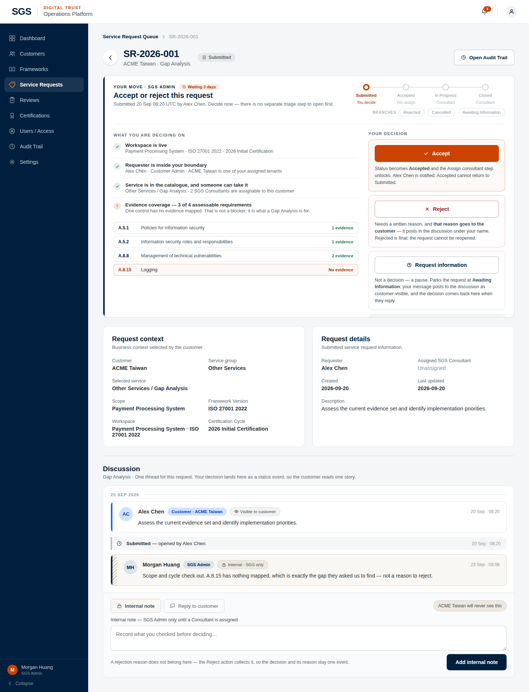 |
| `Accepted.dc.html` | Accepted — assign a consultant | 1440×1820 | 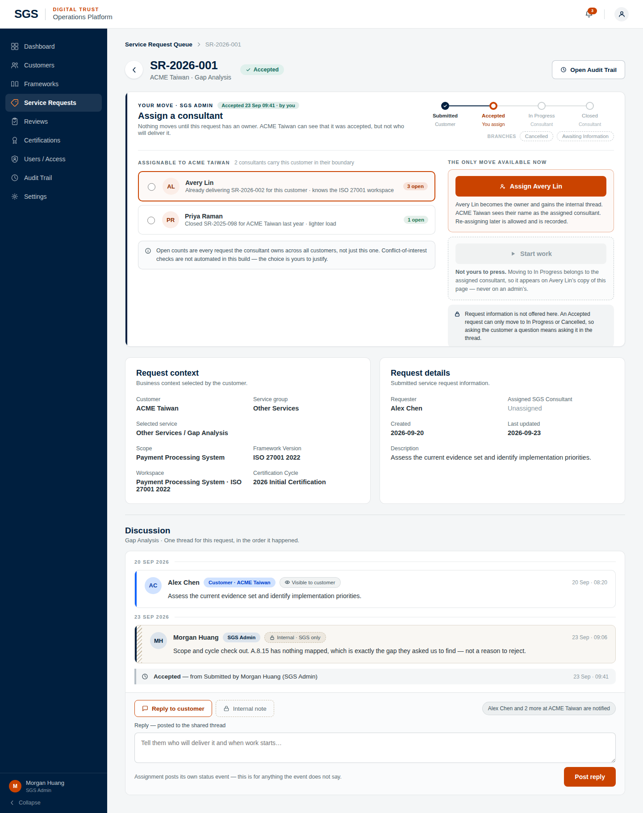 |
| `Queue.dc.html` | SGS queue — next move | 1440×940 | 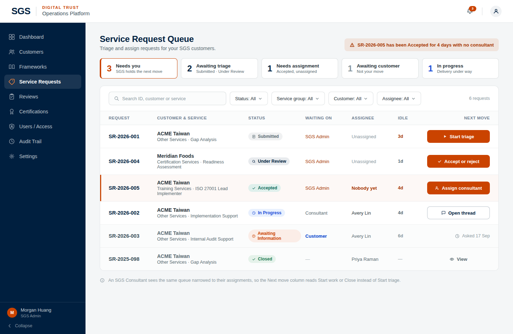 |
| `CustomerList.dc.html` | Customer list — what happens next | 1440×940 | 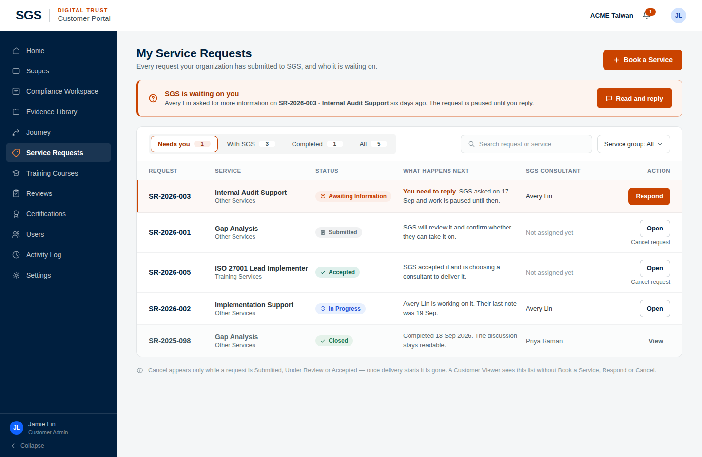 |
| `CustDetail.dc.html` | Customer detail — Accepted | 1440×1060 | 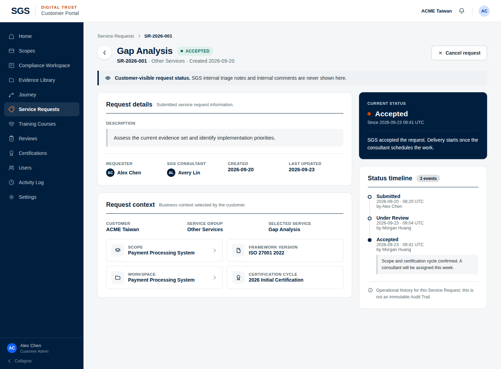 |
| `CustAwaitingInfo.dc.html` | Customer detail — Awaiting Information | 1440×1540 | 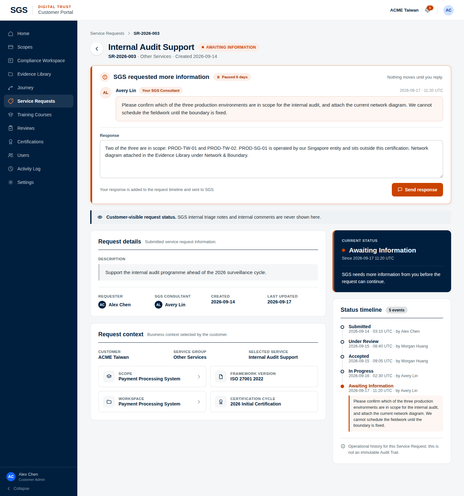 |
| `CustRejected.dc.html` | Customer detail — Rejected | 1440×1220 | 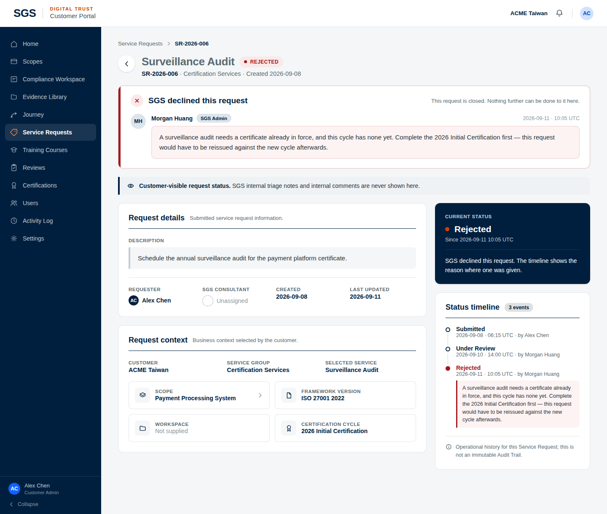 |

## Notes on the canvas

- One session, two audiences
- How it is built
- Why it changes
- Try the filter and the composer tabs on the SGS board — it is interactive.  The two colour axes are the whole idea: hue = who wrote it, hatch + lock = who may read it. Keep them separate and the thread stays readable even when a request has forty entries.
- The whole page, in the shell
- This board follows the sgs-operations-redesign flow instead of the boards above: 1440 wide, IBM Plex Sans, navy rail, 8px controls. Same file ships at design/sgs-operations-redesign/ServiceRequestDetailUnified.dc.html.  Page order changed: actions moved up under the summary, and the discussion sits last because it is the only section that grows without limit.
- Decide on arrival — no triage step
- These two replace the old Start Triage pair, which asked for a click that only revealed the real buttons. Submitted now shows Accept and Reject at once.  The design is ahead of the state machine on purpose: SUBMITTED currently allows only UNDER_REVIEW and CANCELLED, so Accept, Reject and Request info from Submitted each need a transition adding. Design only — see DESIGN-SPEC.  Files: ServiceRequestDetailSubmitted.dc.html and ServiceRequestDetailAccepted.dc.html.
- The two lists, same six requests
- Earlier pass. Both list boards have since been removed from the repo folder — the list is out of scope — so these two are kept here for reference only and are not part of the shipped set.
- Customer detail — flow preserved
- Visual and IA only. Every step, guard and string of customer-service-request-detail.tsx is preserved — the DESIGN-SPEC carries a UI → existing action map, control by control.  The middle board is the one that matters: the SGS ask moves out of the left column into a full-width panel under the title, attributed to the consultant with their avatar and the event timestamp. The same reason still appears in the timeline — promoting it hides nothing.
